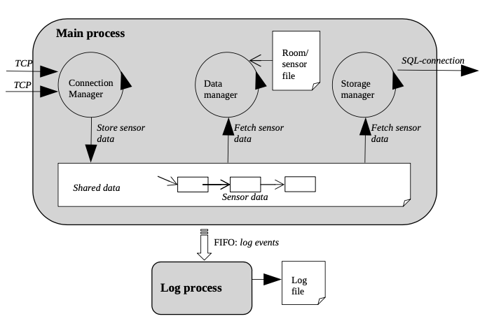

# Sensor Monitoring System



```
Hệ thống gồm có các thành phần:
- Server: xử lý và lưu trữ dữ liệu.
+ Child process: ghi log.
+ Connection thread: xử lý multi client, đẩy dữ liệu từ client vào shared data.
+ Data thread: Xử lý dữ liệu lấy được từ shared data, đưa ra cảnh báo.
+ Storage thread: Lưu trữ dữ liệu đọc được từ shared data.
- Client: gửi dữ liệu từ sensor tới server.
```

## Tạo tiến trình con xử lý log

```
- Sử dụng system call fork để tạo tiến trình con.
- Giao tiếp, nhận thông tin từ tiến trình cha để ghi vào file log. Có thể sử dụng PIPE hoặc FIFO.
- Chú ý: có thể sử dụng lseek để tránh việc bị ghi đè vào file log.
```

## Connection Manager

```
- Để có thể xử lý nhiều client một lúc, cần xây dựng mô hình multi client-server.
- Sử dụng IO multiplexing (select hoặc poll) để xử lý nhiều client cùng lúc.
- Có thể đọc về IO multiplexing qua các sách sau:
+ The Linux Programming Interface.
+ Hands-On Network Programming with C.
+ Beej’s Guide to Network Programming.
```

## Data Manager và Storage Manager

```
- 2 thread này đều có nhiệm vụ lấy dữ liệu từ shared data (linked-list). Vậy làm cách nào để tránh
race-condition và làm sao để xóa dữ liệu cũ sau khi cả 2 thread đều đã lấy được dữ liệu đó?
- Có thể sử dụng thư viện sqlite3 để lưu trữ dữ liệu tại Storage Thread.
- Tham khảo: https://www.sqlite.org/docs.html
```
